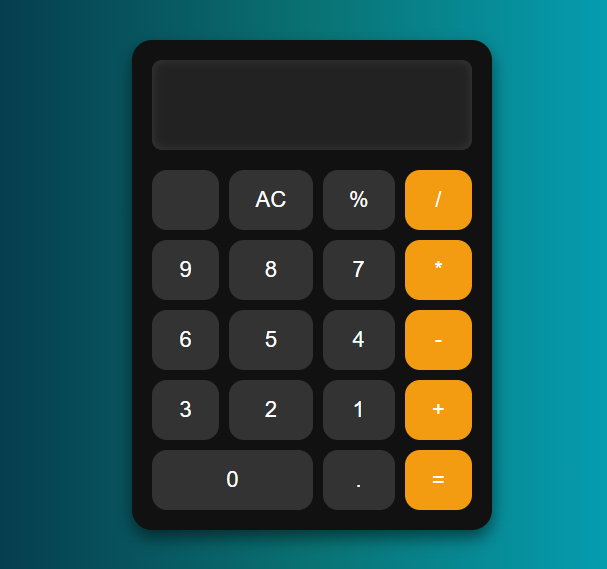

# Calculator App

A simple and responsive calculator web application built with React and TypeScript.  
This project uses modern web technologies like Flexbox and CSS Grid for layout and styling.

### Features
- Basic arithmetic operations (+, -, *, /, %)
- Clear (AC) button
- Error handling for invalid inputs
- Responsive and clean user interface
- Lightweight and easy to use

### Technologies Used
- React
- TypeScript
- CSS Flexbox and Grid

---

## Preview

